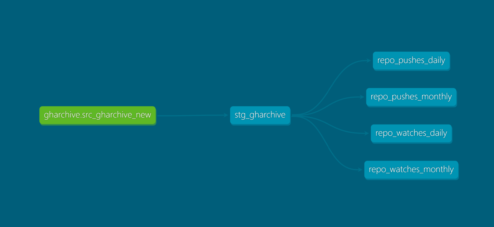

# GitHub Gems: Driving Open-Source Investments With Data

Welcome to the GitHub Gems project! This project hosts a data analytics pipeline that enables smarter investment decisions by measuring the popularity of open-source repos on Github.

## Project Overview

The goal of this project is to develop an efficient data pipeline that streamlines analytics, reduces manual effort, and enables deeper insights into the open-source ecosystem on GitHub. By leveraging modern data tools such as dbt (data build tool) and best practices such as dimensional modeling, we aim to create a scalable and reliable solution for data-driven decision-making.

## User Requirements

What reports do you want to see?

* Identify trends that contribute to successful open-source projects on Github
* Analyze the history of stars and commits for repositories

Who is the target audience?

* Data Analyst team
* Proficient in SQL and Python

What is the timeline of the reports?

* History since the creation of the repo to now

How often should the data be updated?

* Daily

